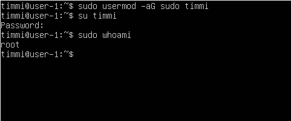
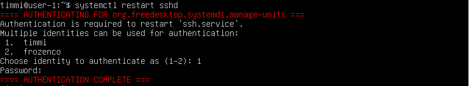
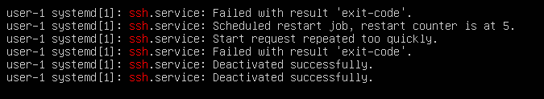

# Установка и настройка ОС Ubuntu

## Часть 1. Установка ОС

1. Определение версии Ubuntu:
    ```bash
        cat /etc/issue
    ```
    

## Часть 2. Создание пользователя

1. Просмотр существующих пользователей:
    ```bash
        cat /etc/passwd
    ```
    

2. Добавление нового пользователя:
    ```bash
        sudo useradd <имя пользователя>
    ```
    

3. Добавление пользователя в группу `adm`:
    ```bash
        sudo usermod -aG adm <имя пользователя>
    ```
    

4. Проверка созданного пользователя:
    ```bash
        cat /etc/passwd
    ```
    

## Часть 3. Настройка сети ОС

1. Задание имени машины:
    ```bash
        sudo vim /etc/hostname
    ```
    

2. Просмотр сетевых интерфейсов:
    ```bash
        ls /sys/class/net
    ```
    

    *Примечание*: `lo` - это loopback интерфейс, используемый для отладки.

3. Установка часового пояса:
    ```bash
        sudo timedatectl set-timezone Europe/Moscow
    ```
    

4. Проверка времени:
    ```bash
        timedatectl
    ```
    

5. Определение IP-адреса устройства:
    ```bash
        ifconfig
    ```
    

    *Примечание*: DHCP - протокол для автоматической настройки IP-адресов и других параметров сети.

6. Определение внешнего и внутреннего IP-адресов:
    ```bash
        ip route | grep default
    ```
    

    ```bash
        route -n
    ```
    

7. Настройка статического IP, шлюза и DNS:
    Открываем файл конфигурации:

    ```bash
        sudo vim /etc/netplan/01-netcfg.yaml
    ```
    
    

    Применение настроек:
    ```bash
        sudo netplan apply
    ```
    

8. Перезагрузка виртуальной машины.

9. Проверка подключения к удалённым хостам:
    Команда для проверки:
    Вывод должен содержать фразу `0% packet loss`.
    ```bash
        ping <адрес хоста>
    ```

    
    

## Part 4. Обновление ОС
1. Обновить системные пакеты до последней на момент выполнения задания версии.
```bash
    sudo apt-get update
```


```bash
    sudo apt-get upgrade
```


## Part 5. Использование команды sudo
1. Разрешить пользователю, созданному в Part 2, выполнять команду sudo.
```bash
    sudo usermod -aG sudo username
```


2. Поменять hostname ОС от имени пользователя
```bash
    sudo hostnamectl set-hostname name
```

```bash
    sudo (англ. Substitute User and do, дословно «подменить пользователя и выполнить») — программа для системного администрирования UNIX-систем, позволяющая делегировать те или иные привилегированные ресурсы пользователям с ведением протокола работы.
```

## Part 6. Установка и настройка службы времени
1. Настроить службу автоматической синхронизации времени.

2. Время, часового пояса, в котором я сейчас нахожусь.
```bash
    timedatectl
```

```bash
    Вывод следующей команды должен содержать `NTPSynchronized=yes: timedatectl status`
```

```bash
    timedatectl show
```


## Part 7. Установка и использование текстовых редакторов
1. Установить текстовые редакторы VIM (+ любые два по желанию NANO, MCEDIT, JOE и т.д.)

```bash
    sudo apt install nano
```


```bash
    sudo apt install mcedit
```


2. Используя каждый из трех выбранных редакторов, создайте файл test_X.txt, где X -- название редактора, в котором создан файл. Написать в нём свой никнейм, закрыкть файл с сохранением изменений.
 
```bash
    vim test_vim.txt
```
```bash
    Вышел с сохранением таким образом: `:wq`
```


```bash
    nano /etc/test_nano.txt
```
```bash
    Вышел с сохранением таким образом: `ctrl+o+x`
```


```bash
    mcedit test_mcedit.txt
```
```bash
    Вышел с сохранением таким образом: `f2+f10`
```


3. Используя каждый из трех выбранных редакторов, открываю файл на редактирование, отредактировал файл, заменив никнейм на строку "21 School 21", закрываю файл без сохранения изменений.

```bash
    vim test_vim.txt
```
```bash
    Вышел без сохранения таким образом: `:q!`
```


```bash
    sudo nano /etc/test_nano.txt
```
```bash
    Вышел без сохранения таким образом: `ctrl+x`
```


```bash
    mcedit /etc/test_mcedit.txt
```
```bash
    Вышел без сохранения таким образом: `f10`
```


4. Используя каждый из трех выбранных редакторов, нужно отредактировать файл ещё раз (по аналогии с предыдущим пунктом), а затем освоить функции поиска по содержимому файла (слово) и замены слова на любое другое.

```bash
    vim test_vim.txt
```
```bash
    /поиск слова
```


```bash
    :s/слово/новое слово/g
```


5. nano
```bash
    ctrl+w поиск слова
```
```bash
    ctrl+w поиск слова
```
```bash
    ctrl+\замена
```


6. mcedit
```bash
    поиск f7
```


```bash
    замена f4
```


## Part 8. Установка и базовая настройка сервиса SSHD
1. Установить службу SSHd.
```bash
    sudo apt-get install ssh
    sudo apt install openssh-server
```


2. Добавить автостарт службы при загрузке системы
```bash
    systemctl status sshd
```


3. Перенастроить службу SSHd на порт 2022.
```bash
    sudo vim /etc/ssh/sshd_config
```


4. Перезагрузить систему.
```bash
    systemctl restart sshd
```


```bash
    ps aux | grep sshd
```


```bash
    netstat -tan
```


```bash
    Команда netstat -tan
    Команда ps aux | grep sshd
```
5. ps aux показывает все процессы, их состояние и дополнительную информацию.
grep sshd фильтрует вывод, чтобы показать только процессы, связанные с sshd.

-t — показывает только TCP соединения.
-a — показывает все активные соединения и порты, на которых прослушиваются подключения.
-n — отображает IP-адреса и порты в числовом формате.

Recv-Q -количество запросов в очередях на приём на данном узле/компьютере
Send-Q -количество запросов в очередях на отправку на данном узле/компьютере
Local Address - адрес и номер локального конца сокета
Foreign Address - адрес и номер порта удаленного порта сокета

## Part 9. Установка и использование утилит top, htop
1. Установить и запустить утилиты top и htop.
```bash
    sudo apt update
    sudo apt install procps htop
```


```bash
    top
```


```bash
    uptime & количество пользователей
```


```bash
   общая загрузка системы
```


```bash
    общее количество процессов
```


```bash
    загрузка cpu
```


```bash
    загрузку памяти
```


```bash
    pid процесса занимающего больше всего памяти
```


```bash
    pid процесса, занимающего больше всего процессорного времении
```


```bash
    htop
```


```bash
    отсортированны по PID
```


```bash
    отсортированны по PERCENT_CPU
```


```bash
    отсортированны по PERCENT_MEM
```


```bash
    отсортированны по TIME
```


```bash
    отфильтрованный для процесса sshd
```


```bash
    с процессом syslog, найденным, используя поиск
```


```bash
    с добавленным выводом hostname, clock и uptime
```


## Part 10. Использование утилиты fdisk
1. Запустить команду fdisk -l.
```bash
    sudo fdisk -l
```

```bash
    название жесткого диска
```


```bash
    размер и количество секторов
```
```bash
    free -h
```


## Part 11. Использование утилиты df
1. Запустить команду df.

```bash
    df /root
```

```bash
    размер раздела = 11758760
```
```bash
    размер занятого пространства = 3362600
```
```bash
    размер свободного пространства = 7777052
```
```bash
    процент использования = 31%
```
```bash
    вывод = килобайты
```
2. Запусти команду df -Th.

```bash
    df -Th /root
```


```bash
    размер раздела = 12G
```
```bash
    размер занятого пространства = 3.3G
```
```bash
    размер свободного пространства = 7.5G
```
```bash
    процент использования = 31%
```
```bash
    тип раздела = ext4
```

## Part 12. Использование утилиты du
1. Вывести размер папок /home, /var, /var/log (в байтах)

```bash
    sudo du -sb /home
```


```bash
    sudo du -sb /var
```


```bash
    sudo du -sb /var/log
```


## Part 13. Установка и использование утилиты ncdu
1. Установить утилиту ncdu
```bash
    sudo apt install ncdu
```


```bash
    sudo ncdu /var
```


```bash
    sudo ncdu /home
```


```bash
    sudo ncdu /var/log
```


## Part 14. Работа с системными журналами
```bash
    sudo less /var/log/dmesg
```


```bash
    sudo less /var/log/syslog
```


```bash
    sudo less /var/log/auth.log
```


```bash
    время последней успешной авторизации = Jul 31 16:06:00

    имя пользователя = timmi-serv

    метод входа в систему = sudo
```
Перезапустить службу SSHd.
```bash
    sudo systemctl restart ssh.service
```

```bash
    cat /var/log/syslog | grep ssh
```


## Part 15. Использование планировщика заданий CRON

```bash
    crontab -e
```


```bash
    grep 'uptime' /var/log/syslog
```


```bash
    crontab -l
    `Cписок текущих задач`
```

```bash
    crontab -r
    `Удаление всех заданий из планировщика задач`
```
